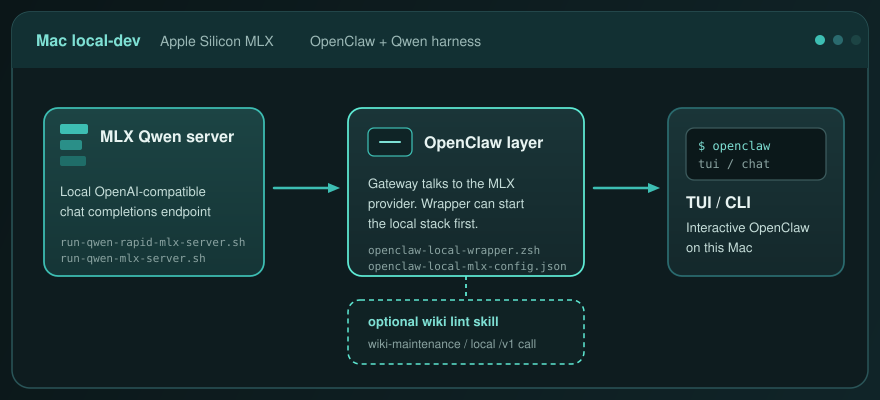

# Mac OpenClaw Harness

**Local-dev OpenClaw on a Mac: MLX Qwen in, gateway/wrapper in the middle, optional wiki lint on the side.**

[](#what-this-is)
[](#whats-in-the-repo)
[](#start-from-the-scripts-in-this-repo)
[](#how-the-pieces-connect)
[](#what-this-is-not)

<p align="center">
  
</p>

This repository is a **Mac local-dev harness** for [OpenClaw](https://github.com/openclaw/openclaw) plus an on-machine MLX Qwen backend. It is wrapper scripts, server launchers, an example provider config, and a wiki-maintenance skill — not a packaged product and not a live status page.

## What this is

A checkout you run on Apple Silicon when you want OpenClaw talking to a local Qwen model through MLX.

- Two server launchers for a local OpenAI-compatible Qwen endpoint
- An example OpenClaw provider block aimed at that endpoint
- A zsh wrapper that can start the Rapid-MLX script and the OpenClaw gateway before interactive commands
- An optional Obsidian wiki lint skill that calls the same local `/v1` endpoint

## What this is not

- **Not** [openclaw-harness-autoresearch](https://github.com/Kristianaaron/openclaw-harness-autoresearch). That repo is an OpenClaw-only research loop (question → experiment → evidence). This one is a Mac MLX Qwen runtime harness.
- **Not** a Windows or WSL OpenClaw snapshot. Scripts assume macOS, Homebrew `openclaw`, and MLX.
- **Not** an installer, npm package, or PyPI package. There is nothing to `pip install` or `npm i` from this tree.
- **Not** live machine status. [SETUP.md](SETUP.md) is a **2026-04-26 lab log** (paths, throughput, “currently running”). Treat it as historical notes, not current ports or tok/s.

## What's in the repo

| Path | Role |
| --- | --- |
| [`run-qwen-rapid-mlx-server.sh`](run-qwen-rapid-mlx-server.sh) | Starts `rapid-mlx serve` for model id `qwen3.6-27b`. Default bind is `127.0.0.1:8000`. |
| [`run-qwen-mlx-server.sh`](run-qwen-mlx-server.sh) | Alternate launcher: `mlx_lm.server` from a local `.venv-mlx312`, default repo `unsloth/Qwen3.6-27B-UD-MLX-6bit`, default bind `127.0.0.1:8080`. |
| [`openclaw-local-mlx-config.json`](openclaw-local-mlx-config.json) | Example OpenClaw provider block. Points the `mlx` provider at `http://127.0.0.1:8000/v1` and model id `qwen3.6-27b`. |
| [`openclaw-local-wrapper.zsh`](openclaw-local-wrapper.zsh) | zsh helper (intended as `~/.zfunc/openclaw`) that starts the Rapid-MLX script, then Homebrew `openclaw`. |
| [`opencode.json`](opencode.json) | Small local OpenCode MCP snippet. Not required to run the harness. |
| [`wiki-maintenance/`](wiki-maintenance/README.md) | Optional Obsidian wiki lint skill. |
| [`SETUP.md`](SETUP.md) | Historical lab notes from 2026-04-26. |

## How the pieces connect

```text
MLX Qwen server          OpenClaw                 You
(rapid-mlx or mlx_lm) -> gateway + wrapper   ->  tui / chat / agent
                                |
                                +-> optional wiki-maintenance lint
```

1. A server script exposes a local OpenAI-compatible `/v1` API.
2. OpenClaw reads a provider config like `openclaw-local-mlx-config.json` and sends completions there.
3. The wrapper, if you install it, checks that local endpoint before `tui`, `terminal`, `chat`, `gateway`, or `agent`, then execs `/opt/homebrew/bin/openclaw`.
4. The wiki lint skill is optional. It can call the same Rapid-MLX-shaped `/v1/chat/completions` URL. See [wiki-maintenance/README.md](wiki-maintenance/README.md).

The example config matches the **Rapid-MLX** launcher (port `8000`, model id `qwen3.6-27b`). The `mlx_lm.server` script is a separate path with its own defaults; point OpenClaw at it only if you change the provider URL and model id to match.

## Start from the scripts in this repo

These commands assume you already have OpenClaw (Homebrew on Apple Silicon) and whichever MLX server binary the script you pick expects. This repo does not install those tools.

**Rapid-MLX path** (matches the checked-in OpenClaw example):

```bash
./run-qwen-rapid-mlx-server.sh
```

Override bind or model with the env vars the script already reads: `HOST`, `PORT`, `MODEL`, plus the batching/cache knobs in the file.

**mlx_lm path** (needs `$PWD/.venv-mlx312/bin/mlx_lm.server`, or set `MLX_SERVER`):

```bash
./run-qwen-mlx-server.sh
```

Override with `MODEL_REPO`, `HOST`, `PORT`, `MLX_SERVER`, and the sampling knobs in the file.

Then merge [`openclaw-local-mlx-config.json`](openclaw-local-mlx-config.json) into your local OpenClaw config so the `mlx` provider URL and model id match the server you actually started. Start the OpenClaw gateway with your own local token and port — do not reuse lab-log values from `SETUP.md`.

The wrapper is a **lab helper**, not a portable installer. It hardcodes a machine-local checkout path for the Rapid-MLX script and a Homebrew `openclaw` binary. Copy it only after you change that path to your clone.

## Wiki maintenance

Optional. Copy the skill into your OpenClaw skills directory and point `vault_path` at your vault. Details live in [wiki-maintenance/README.md](wiki-maintenance/README.md).

## License and secrets

No license file is checked in. Do not commit `.env`, gateway tokens, or live credentials. The example config uses a non-secret local placeholder key for an on-machine endpoint.
