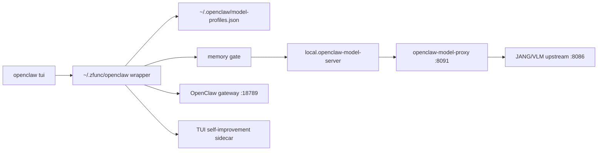

# Mac OpenClaw Harness

Mac-side harness for running OpenClaw TUI against the local Gemma 4 31B JANQ
model through the hardened OpenClaw model-profile runtime.

## What This Adds

- Gemma JANQ profile-driven startup instead of the old Qwen port-8000 scripts.
- Memory-gated LaunchAgent startup for the 31B local model.
- Prefix warmup before TUI use when the warmer is installed.
- Gateway startup on port `18789`.
- A TUI self-improvement sidecar that watches for runtime drift, memory pressure,
  model/gateway reachability, repeated reasoning leakage, tool-call errors, and
  recent crash markers.

## Runtime Shape



## References And Design Lineage

- OpenClaw native CLI/TUI remains the public interface.
- The model-profile layer mirrors the hardened OpenClaw autoresearch harness:
  model selection is config/profile driven, while the gateway stays model agnostic.
- The self-improvement sidecar uses the same principle as the autoresearch
  evolution layer: observe first, write durable memory, and avoid live runtime
  mutation unless a future explicit promotion gate is added.

## Quick Start

```bash
./scripts/install-openclaw-harness.sh
openclaw doctor
openclaw tui
```

The installer preserves an existing `~/.zfunc/openclaw` wrapper by default so it
does not remove autoresearch commands from a live setup. To replace the active
wrapper after review, run:

```bash
OPENCLAW_INSTALL_REPLACE_WRAPPER=1 ./scripts/install-openclaw-harness.sh
```

## Development Checks

```bash
./scripts/verify-harness.sh
git diff --check
```

## Repository Boundary

This repository is for the OpenClaw TUI harness only. It intentionally does not
ship opencode configuration or MCP setup.
